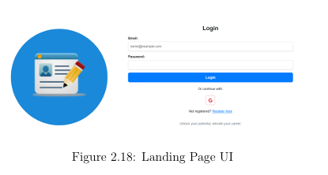
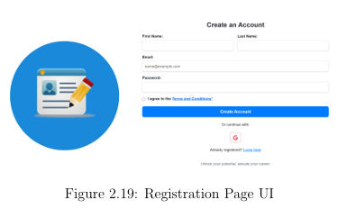
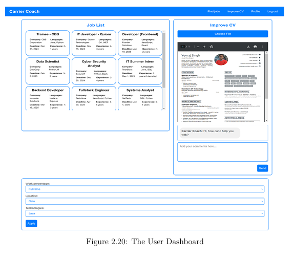

# Personal Career Coach Application

## Overview
The **Personal Career Coach** application is an innovative, AI-powered platform designed to help recent IT graduates successfully navigate the job market. It leverages cutting-edge Large Language Models (LLMs) and multimodal AI to provide tailored career support, including resume analysis, personalized job matching, interview preparation, and real-time company identification using visual recognition.

## My Contributions

### Data Science
- **Datasets & Analysis**:
  - Discovered and processed essential datasets containing resumes, job descriptions, and required skills for IT roles.
  - Conducted thorough preprocessing (tokenization, lemmatization, vectorization) to optimize data for machine learning models.

- **Model Development**:
  - Initially fine-tuned models like logistic regression, random forests, and deep learning algorithms.
  - Transitioned to fine-tuning pre-existing AI models for improved accuracy and efficiency in matching resumes to job descriptions.

- **Web Scraping**:
  - Implemented and enhanced web scraping scripts to collect job listings from LinkedIn and Indeed, incorporating resilience to HTML structural changes and integrating salary, location, and company data.

- **Company Logo Collection**:
  - Curated high-quality company logos and implemented automated scripts for data augmentation (e.g., rotation, zooming, lighting adjustments) to train visual recognition models.

- **Team Coordination**:
  - Managed task allocation, facilitated regular progress updates, and organized collaborative activities such as pair programming and knowledge sharing.

### Frontend Development
- **User Interface & Experience**:
  - Built responsive, user-friendly frontend designs based on wireframes using React, HTML, CSS, and JavaScript.
  - Ensured cross-device compatibility, accessibility, and optimized user interactions.

- **Interactive Dashboard**:
  - Integrated live job listing data from Arbeidsplassen API and scraped sources into the user dashboard.
  - Added dynamic filters, analytics (e.g., skill demand, salary insights), and visual summaries to enhance user engagement.

- **AI Chatbot (TinyLlama)**:
  - Integrated TinyLlama chatbot for real-time, context-aware user assistance during the job search.
  - Optimized chatbot interactions with refined prompts for clarity and user-centric responses.

- **Customization Features**:
  - Developed a settings interface allowing users to personalize their job search preferences by location, industry, and experience level.
  - Integrated backend analytics and predictive models to proactively offer personalized job recommendations.

## Key Features
- **Resume Analysis**: Real-time feedback for improving resumes.
- **Job Matching**: Customized recommendations based on user skills and job criteria.
- **Interview Preparation**: AI-assisted chatbot providing role-specific guidance.
- **Company Logo Detection**: Real-time identification of companies through YOLOv8 visual recognition, connecting physical encounters with digital job opportunities.

## Technologies Used
- **Frontend**: ReactJS
- **Backend**: Spring Boot, Java
- **Databases**: MySQL, MongoDB
- **AI Models**: LLaMA, TinyLlama, YOLOv8
- **Deployment**: Docker, Raspberry Pi-based EdgeAI infrastructure
  
## Screenshots

